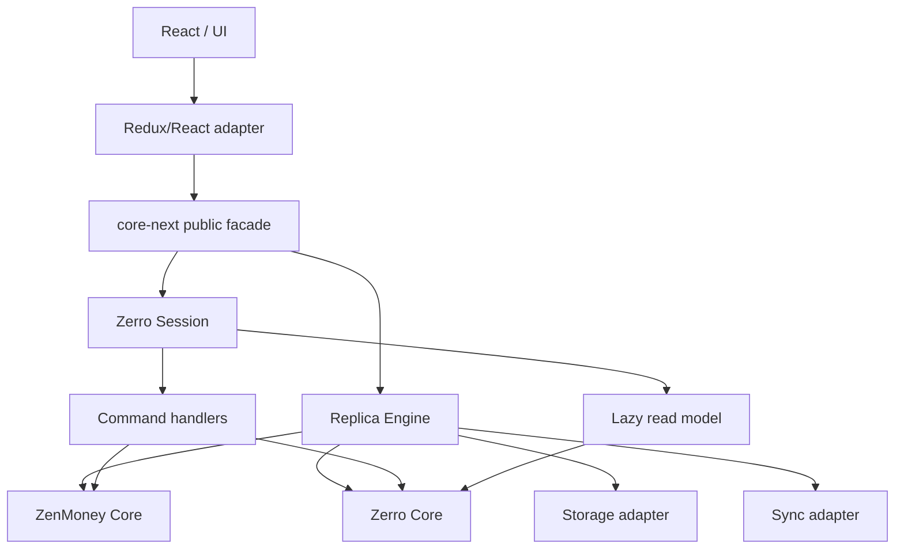

# Core Next: a facade domain module for Zerro

Date: 2026-07-05  
Status: design document, target architecture for gradual migration

## Summary

We want to extract Zerro domain logic into a storage-agnostic module that can be used not only by the current React/Redux app, but also in headless modes: a worker, a local server, AI-agent tools, tests, or a future no-server mode.

From the application point of view, this should look like one module with one public facade. Internally, it may be split into `zenmoney`, `zerro`, `replica`, `projections`, and other parts, but the app should not depend on those internal boundaries.

Working name during the migration:

```txt
src/core-next/
```

Later, the module can be renamed to `src/domain` or moved into a separate package.

## Goals

1. Separate domain logic from Redux, React, IndexedDB, and the ZenMoney API.
2. Preserve the constraint that Zerro-specific data is stored inside ZenMoney-compatible data.
3. Provide one facade for both the app and headless scenarios.
4. Support the `base + outbox + inbox + current` model.
5. Support undo/redo for local unsynced changes through an outbox pointer, without inverse patches.
6. Make it possible to compare the new implementation with the current one before switching the UI.
7. Make the migration incremental: every step should be small, understandable, and testable.

## Non-goals for the first stage

The first stage does not try to radically solve memory pressure on very large accounts. Data may remain in memory, as it does today.

The first stage also does not implement a rich preview of incoming server changes. It is enough to show that remote changes exist, show their count, and let the user apply or defer them.

## Core idea

The core module should not be a storage layer. It should be a set of pure domain operations:

```ts
state + command => patch
state => derived view
base + patches => current
```

Storage, persistence, Redux subscriptions, React hooks, and ZenMoney API calls stay in external adapters.

## Target diagram



## Public facade

The app should import only the facade:

```ts
import { createZerroSession, createZerroEngine } from 'core-next'
```

Internal modules such as `core-next/zerro/envelopes/buildEnvelopes` should not become part of the app-facing API.

Adapter-level APIs should also not be exported from the root facade. For example, Redux selectors should be imported explicitly from the adapter path:

```ts
import { selectCoreEnvelopes } from 'core-next/adapters/redux'
```

The root `core-next` entrypoint must stay safe for storage-agnostic and headless usage. It should not pull Redux, React, `5-entities`, or i18n adapter dependencies into ordinary domain imports.

### `createZerroSession`

`Session` is a pure session over a single snapshot. It is useful for reads, command compilation, tests, comparisons with the legacy system, and headless requests.

Example:

```ts
const session = createZerroSession(current, {
  now,
  uuid,
})

const envelopes = session.read.envelopes()
const budgets = session.read.budgets()

const patch = session.envelopes.rename(id, 'Food')
```

`Session` may also expose `execute(command)` as an advanced API for tests, devtools, migrations, headless tools, and command replay from JSON. The ergonomic domain methods are the primary app-facing API.

The context should contain only non-deterministic dependencies:

```ts
type CoreContext = {
  now: () => number
  uuid: () => string
}
```

`mainUserId` is not passed through the context. It must be derived from the data: the root user is the user without `parent`.

### `createZerroEngine`

`Engine` is the stateful wrapper for the application. It manages `base`, `baseServerTimestamp`, `outbox`, `outboxHead`, `inbox`, and `current`.

Example:

```ts
const engine = createZerroEngine({
  base,
  baseServerTimestamp,
  outbox,
  outboxHead,
  inbox,
  ctx: {
    now,
    uuid,
  },
})

engine.transactions.create(input)
engine.envelopes.rename(id, 'Food')
engine.budgets.set(envelopeId, month, value)
engine.undo()
engine.redo()
engine.applyRemote()

const current = engine.getCurrent()
```

## Terms

### `base`

The last accepted state. In normal operation, this is the state confirmed by the server or by a local checkpoint.

### `outbox`

A local log of commands and compiled patches.

```ts
type LocalEntry = {
  id: string
  command: Command
  patch: NormalizedPatch
  createdAt: number
}
```

The command is stored in high-level form so it can be shown in history, explained to the user, used in headless scenarios, and migrated if needed.

Replay uses `patch`; it does not re-execute the command.

### `outboxHead`

A pointer that defines how much of the outbox history should be applied.

```ts
current = replay(base, outbox.slice(0, outboxHead))
```

Undo/redo only move this pointer:

```ts
undo: outboxHead -= 1
redo: outboxHead += 1
```

No inverse patch is needed.

If the user performs undo and then executes a new command, the history tail after `outboxHead` is dropped:

```ts
outbox = outbox.slice(0, outboxHead)
outbox.push(newEntry)
outboxHead = outbox.length
```

### `current`

The current application state:

```ts
current = applyPatches(base, outbox.slice(0, outboxHead))
```

`current` may be cached in memory for convenience, but the source of truth is `base`, `outbox`, and `outboxHead`.

### `inbox`

A deferred remote batch.

For the first stage, the inbox does not need to contain a rich field-level preview. This is enough:

```ts
type RemoteBatch = {
  serverTimestampBefore: number
  serverTimestampAfter: number
  receivedAt: number
  changesCount: number
  patch: NormalizedPatch
}
```

While `inbox` is pending, the UI can show: “There are N changes from the server”.

## Internal module structure

Suggested structure:

```txt
src/core-next/
  index.ts
  constants.ts
  types.ts

  facade/
    createZerroSession.ts
    createZerroEngine.ts

  zenmoney/
    applyPatch.ts
    mergePatches.ts
    replay.ts
    users.ts
    constants.ts
    commands/
    types.ts

  zerro/
    constants.ts
    types.ts
    hidden-data/
      types.ts
      codecs.ts
      migrations.ts
      serviceAccount.ts
    envelopes/
    budgets/
    goals/
    userSettings/
    commands/

  projections/
    rawActivity/
    activity/
    envMetrics/
    monthTotals/

  replica/
    outbox.ts
    inbox.ts
    engineState.ts

  adapters/
    redux/

  testing/
    compareWithLegacy.ts
    fixtures/
```

This does not have to be the final structure. The important rule is that `src/core-next/index.ts` remains the public API for application/domain consumers. Adapter-level APIs may be exported from their own explicit entrypoints, such as `core-next/adapters/redux`, but they should not be re-exported from the root facade.

## Types and constants

`core-next` should own domain types and domain constants.

This includes:

- normalized ZenMoney entity types;
- normalized patch/diff types;
- Zerro entity types such as envelopes, goals, budgets, user settings, and hidden-data payloads;
- command types;
- replica state types;
- projection result types;
- domain constants.

The app and the early `core-next` implementation may temporarily keep importing legacy types from `6-shared/types` during migration. This is acceptable for now and avoids a risky big-bang type move.

The target state is still that core-facing code imports domain types from `core-next`. The migration should happen gradually:

1. `core-next/types.ts` may initially re-export selected legacy types under core-oriented names.
2. New Zerro-specific types should be defined inside `core-next` first.
3. As modules move, their types should move with them.
4. Only after the domain module stabilizes should we consider moving normalized ZenMoney entity definitions out of `6-shared/types`.

Do not duplicate large entity type definitions just to satisfy the architecture. Prefer temporary re-exports until the implementation boundary is stable.

Core constants should also live in the module, not in React/Redux entity folders.

Examples:

```ts
export const ZERRO_DATA_ACCOUNT_NAME = '🤖 [Zerro Data]'
```

```ts
export enum HiddenDataType {
  Goals = 'goals',
  FxRates = 'fxRates',
  Budgets = 'budgets',
  LinkedAccounts = 'linkedAccounts',
  LinkedDebtors = 'linkedDebtors',
  EnvelopeMeta = 'EnvelopeMeta',
  UserSettings = 'UserSettings',
  TagOrder = 'tagOrder',
}
```

The current legacy name `DATA_ACC_NAME` can be re-exported or mapped during migration, but the core name should be explicit and domain-oriented.

## ZenMoney Core

`zenmoney` works only with normalized data.

It must not know about:

- React;
- Redux;
- selectors;
- IndexedDB;
- ZenMoney HTTP API;
- hidden Zerro semantics.

Responsibilities:

- normalized data types;
- patch application;
- patch merge/replay;
- basic commands over ZenMoney entities;
- basic validation;
- deriving the root user from data;
- cascade operations when they are part of the local domain model.

Examples:

```ts
applyPatch(data, patch) => nextData
replay(base, patches) => current
getRootUser(data) => user | null
getRootUserId(data) => userId | null
editTransaction(data, command, ctx) => patch
deleteAccount(data, command, ctx) => patch
```

The external ZenMoney API format is not part of `zenmoney-core`. Conversion between raw ZenMoney diff and normalized patch should live in a separate adapter layer.

## Zerro Core

`zerro` depends on `zenmoney`, but not on storage.

Responsibilities:

- Zerro hidden-data formats;
- hidden-data migrations;
- automatic creation of the `🤖 [Zerro Data]` service account when needed;
- reading and writing user settings;
- envelopes;
- budgets;
- goals;
- debtor/linking semantics, if they are Zerro-specific;
- high-level Zerro commands.

Examples:

```ts
readHiddenData(data, type) => payload
writeHiddenData(data, type, payload, ctx) => patch
migrateHiddenData(data, ctx) => patch | null
readEnvelopes(data) => ById<Envelope>
patchEnvelope(data, command, ctx) => patch
setEnvelopeBudget(data, command, ctx) => patch
```

If writing hidden data requires a service account, Zerro Core compiles a patch that creates this account and writes the reminder.

## App runtime and Redux interaction

In the React app, Redux remains the subscription mechanism for UI components.

Core should not become a second reactive store for the app. The app runtime should have one state owner:

```txt
Redux domain slice owns:
  base
  baseServerTimestamp
  outbox
  outboxHead
  inbox
  current
```

The app-facing engine is a facade over Redux:

```ts
engine.transactions.create(input)
engine.envelopes.rename(id, name)
engine.undo()
```

In the React app, these methods dispatch Redux actions/thunks. The thunk uses core to compile a command into a patch, and the reducer updates `outbox`, `outboxHead`, and `current`.

```txt
Component
  -> engine.transactions.create(input)
  -> Redux thunk/action
  -> core compiles command to patch
  -> reducer stores command + patch in outbox
  -> reducer rebuilds current
  -> Redux selectors notify subscribed components
```

The headless runtime may use a stateful in-memory engine with the same facade shape. The React app should prefer the Redux-backed facade to avoid two sources of truth.

## Read model and selectors

Current Redux selectors mix three things:

1. domain logic;
2. memoization;
3. coupling to the Redux state shape.

In the new architecture, domain logic should live in core projectors, while Redux selectors should become thin adapters.

The important performance rule is that core projectors must have explicit dependencies. We should not build one large selector from `current`, because any patch would invalidate the whole read model.

Bad app-level shape:

```ts
createSelector([selectCurrent], current => createReadModel(current))
```

This would invalidate expensive transaction-based projections after unrelated changes such as budgets, envelope metadata, or user settings.

Preferred shape:

```ts
// core
buildRawActivity({
  transactions,
  inBudgetAccounts,
  debtAccountId,
  debtors,
  instruments,
})

buildActivity({
  rawActivity,
  keepingEnvelopeIds,
})

buildEnvMetrics({
  monthList,
  envelopes,
  activity,
  budgets,
  convertFx,
})

// app adapter
selectRawActivity = createSelector(
  [
    selectTransactionsHistory,
    selectInBudgetAccounts,
    selectDebtAccountId,
    selectDebtors,
    selectInstruments,
  ],
  buildRawActivity
)

selectActivity = createSelector(
  [selectRawActivity, selectKeepingEnvelopeIds],
  buildActivity
)

selectEnvMetrics = createSelector(
  [
    selectMonthList,
    selectEnvelopes,
    selectActivity,
    selectBudgets,
    selectFxConverter,
  ],
  buildEnvMetrics
)
```

This preserves the current important optimization: `rawActivity` scans transactions and should not be recomputed when only budgets or unrelated envelope metadata change.

Commands must not import Redux selectors directly. Instead, `Session` provides a lazy memoized read model:

```ts
const session = createZerroSession(current, ctx)

session.read.envelopes()
session.read.budgets()
session.read.userSettings()
```

Inside a headless session, results are cached for the session lifetime. The headless cache should use the same projection graph and dependency boundaries as the Redux adapter.

```ts
function createReadModel(data) {
  let envelopesCache

  return {
    envelopes() {
      return envelopesCache ??= buildEnvelopes(data)
    },
  }
}
```

This keeps core independent from any selector framework while avoiding repeated recomputation of the same derived data inside one command.

There should be one source of domain calculation logic:

```txt
core projectors:
  what to calculate and from which dependencies

Redux selectors:
  how React subscribes and how memoization is wired in the app runtime

headless read model:
  how the same graph is memoized without Redux
```

## Projections

Heavy computations such as `rawActivity`, `activity`, `envMetrics`, and `monthTotals` are core projections.

They should live in `core-next/projections`.

These projections are not just UI helpers. They are part of Zerro domain logic and must be available in headless mode. Future commands may need them. For example, a command such as “fulfill all goals” needs to compare goals with current envelope balances/available amounts before compiling patches.

At the same time, not every command should trigger heavy projections.

Rule:

> A command should not depend on a heavy analytical projection unless that projection is a real domain invariant.

For example:

- renaming an envelope should not require env metrics;
- changing a budget usually should not require recomputing all spending;
- moving an envelope may require envelopes/structure;
- deleting an account may require related transactions, but that is normalized data work, not analytics.
- fulfilling goals may require current envelope metrics, because the command must know available balances.

If a command truly requires aggregates, it should get them through `session.read`, not through a Redux selector.

### Projection API levels

Core should expose projections at three levels.

#### 1. Public read API

This is the semantic API for app code, headless tools, and tests:

```ts
engine.read.envelopes()
engine.read.budgets()
engine.read.envMetrics()
engine.read.monthTotals()
```

#### 2. Adapter-level projection graph API

This API is for runtime adapters such as Redux selectors and the headless read model:

```ts
projections.buildRawActivity(...)
projections.buildActivity(...)
projections.buildEnvMetrics(...)
projections.buildMonthTotals(...)
```

`rawActivity` and `activity` are allowed to be public at this adapter level because they are important dependency graph nodes. They are not recommended as direct UI API unless a screen truly needs them.

#### 3. Private helpers

Implementation details such as leftover calculations, children aggregation helpers, and low-level transaction classification helpers should stay private unless they become stable domain concepts.

### Carry-forward metrics

`envMetrics` is a carry-forward projection. The current month cannot be calculated independently, because envelope leftovers depend on previous months.

Requesting current-month metrics may require calculating the full month range from the first relevant transaction month through the requested month.

This is expected. The optimization goal is not to avoid the month chain. The optimization goal is to avoid invalidating expensive upstream nodes such as `rawActivity` when changes do not affect them.

For example:

```txt
budget changed
  -> rawActivity stays cached
  -> activity stays cached unless keeping-envelope rules changed
  -> envMetrics recalculates

transaction changed
  -> rawActivity recalculates
  -> activity recalculates
  -> envMetrics recalculates

envelope comment changed
  -> rawActivity stays cached
  -> activity usually stays cached
  -> envelopes/envMetrics update if needed
```

## Commands and ergonomic facade API

Commands stored in the outbox should be high-level and serializable.

Example:

```ts
type Command =
  | {
      type: 'zenmoney.transaction.edit'
      payload: TransactionEditPayload
    }
  | {
      type: 'zerro.envelope.patch'
      payload: EnvelopePatchPayload
    }
  | {
      type: 'zerro.budget.set'
      payload: BudgetSetPayload
    }
```

The main app-facing API should still be ergonomic domain methods:

```ts
engine.transactions.create(input)
engine.transactions.edit(id, patch)
engine.transactions.delete(ids)

engine.accounts.create(input)
engine.accounts.patch(id, patch)
engine.accounts.delete(id)

engine.envelopes.patch(id, patch)
engine.envelopes.rename(id, name)
engine.envelopes.move(id, parentId)

engine.budgets.set(envelopeId, month, value)
engine.settings.patch(patch)
```

Internally, these methods create a command object and pass it to the command execution pipeline:

```ts
engine.transactions.create(input)
// internally:
engine.execute(commands.transactions.create(input))
```

`engine.execute(command)` and `session.execute(command)` may remain public as advanced escape hatches, but regular app code should prefer the domain methods.

The result is stored in the outbox:

```ts
outbox.push({
  id: ctx.uuid(),
  command,
  patch,
  createdAt: ctx.now(),
})
```

The patch should be a deterministic result. Replay must not re-execute commands.

## Sync

For the first stage, sync can work like this:

1. If `inbox` exists, a new sync does not start or reports that deferred remote changes are pending.
2. If `inbox` is empty, the app may fetch the remote diff.
3. If the remote diff is not empty, it is stored as `inbox`.
4. The UI shows the number of changes.
5. The user applies or defers the changes.
6. On apply:

```ts
base = applyPatch(base, inbox.patch)
current = replay(base, outbox.slice(0, outboxHead))
inbox = null
```

7. Only the applied outbox prefix is sent to the server:

```ts
pending = outbox.slice(0, outboxHead)
```

After successful upload, the applied prefix can be committed into `base`:

```ts
base = replay(base, outbox.slice(0, outboxHead))
outbox = outbox.slice(outboxHead)
outboxHead = 0
```

## Storage adapters

Core must not know where data is stored.

An external adapter may persist:

- `base`;
- `baseServerTimestamp`;
- `outbox`;
- `outboxHead`;
- `inbox`;
- optionally, cached `current`.

The first adapter is the current IndexedDB/localData layer.

Possible future adapters:

- memory adapter for tests;
- local server adapter;
- SQLite/OPFS adapter;
- no-server local-only adapter.

## Migrations

Zerro hidden-data migrations are part of Zerro Core.

Reason: the hidden-data format is a Zerro domain contract, not a UI or Redux concern.

Core should be able to:

- read an old format;
- convert it to the current runtime format;
- when needed, compile a patch that writes the upgraded format back into ZenMoney-compatible data.

Example API:

```ts
const migrationPatch = session.migrations.getPatch()

if (migrationPatch) {
  engine.applyLocalPatch({
    type: 'zerro.migrations.apply',
    patch: migrationPatch,
  })
}
```

The exact API shape may change, but the responsibility should stay inside core.

## Comparing with the legacy system

The new module should live next to the legacy system for a while. Before switching the UI, we need to compare results.

Example checks:

```ts
const legacy = envelopeModel.getEnvelopes(reduxState)
const next = createZerroSession(reduxState.data.current, ctx).read.envelopes()

expect(next).toEqual(legacy)
```

For commands, it is better to compare not only the patch, but also the resulting state:

```ts
const oldStateAfter = runLegacyThunk(stateBefore, thunk)
const patch = session.execute(command)
const newStateAfter = applyPatch(stateBefore.data.current, patch)

expect(newStateAfter).toEqual(oldStateAfter.data.current)
```

This matters because the new and old code may produce patches with slightly different shape while still producing the same final state.

## Step-by-step plan

### Step 0. Add the design document

Result:

- `documents/core-next-architecture.md` exists;
- boundaries, goals, and the plan are documented.

Verification:

- the document reads as a migration plan;
- no runtime code changes.

### Step 1. Create the `src/core-next` skeleton

Result:

- `src/core-next` exists;
- `index.ts` exists;
- minimal or empty `zenmoney`, `zerro`, `replica`, `facade`, and `testing` modules exist;
- public imports go only through `core-next/index.ts`.

Verification:

- `pnpm lint` / `tsc` passes;
- app behavior does not change.

### Step 2. Move patch/replay primitives

Result:

- `core-next/zenmoney` contains `applyPatch`, `applyPatchMutable`, and `replay`;
- behavior matches the current `store/data/shared/applyDiff.ts`;
- legacy code is not switched yet.

Verification:

- unit tests for creating, updating, and deleting entities;
- comparison tests against the current `applyDiffMutable`;
- replaying several patches produces the expected `current`.

### Step 3. Add `createZerroSession`

Result:

- the `createZerroSession(data, ctx)` facade exists;
- `ctx` contains `now()` and `uuid()`;
- root user, root user id, and user currency are derived from data;
- `mainUserId` is not passed through context.

Verification:

- tests for root user detection: user without `parent`;
- tests for missing root user;
- tests for user currency.

### Step 4. Move hidden-data codecs and migrations

Result:

- core can read a simple hidden store;
- core can read a monthly hidden store;
- core contains hidden-data migrations;
- core does not import Redux, thunks, or selectors.

Verification:

- comparison tests against current hidden-store selectors;
- tests for malformed comments;
- tests for unknown/old formats;
- tests for migration patches.

### Step 5. Implement the service account write path

Result:

- Zerro Core can create the `🤖 [Zerro Data]` service account by itself when it is missing;
- writing hidden data compiles into one patch: ensure account + set reminder.

Verification:

- if the account already exists, a new one is not created;
- if the account is missing, the patch creates it;
- writing simple hidden data creates/updates a reminder;
- writing an empty monthly payload deletes or clears data according to current rules.

### Step 6. Move the envelopes read model

Result:

- `session.read.envelopes()` returns the same envelopes as the current `envelopeModel.getEnvelopes`;
- envelope structure is built by core functions;
- the Redux selector can become an adapter wrapper around the core projector.

Verification:

- comparison tests on demo data;
- comparison tests on real/anonymized fixtures, if available;
- cases: tag envelope, account envelope, debtor envelope, meta fields, parent/group/index.

### Step 7. Move the budgets read model

Result:

- `session.read.budgets()` matches the current `budgetModel.get`;
- ZenMoney tag budgets are supported;
- Zerro env budgets are supported;
- `preferZmBudgets` is respected.

Verification:

- comparison tests against the current selector;
- cases: tag envelope + `preferZmBudgets`;
- cases: account/debtor envelope;
- monthly hidden budget data.

### Step 8. Implement the first Zerro command: `zerro.envelope.patch`

Result:

- the command accepts a high-level payload;
- core compiles it into a normalized patch;
- the patch covers tag/account/merchant/meta changes;
- the command does not dispatch Redux actions.

Verification:

- the resulting state after the new patch matches the resulting state after the current `patchEnvelope` thunk;
- cases: rename, color, parent, group, comment, currency, keepIncome, carryNegatives.

### Step 9. Implement the budget command: `zerro.budget.set`

Result:

- the command compiles set budget into either a tag budget or a hidden env budget;
- behavior matches the current `setBudget`.

Verification:

- compare resulting state with the old thunk;
- cases: `preferZmBudgets = true`;
- cases: `preferZmBudgets = false`;
- cases: empty budget payload.

### Step 10. Implement basic ZenMoney commands

Result:

- transaction edit/create/delete;
- account patch/create/delete;
- tag/category patch/create/delete;
- merchant patch/create/delete;
- basic validations.

Verification:

- compare resulting state with old thunks;
- tests for `changed = ctx.now()`;
- tests for `id = ctx.uuid()`;
- tests for root user id derived from data.

### Step 11. Implement `createZerroEngine`

Result:

- engine stores `base`, `baseServerTimestamp`, `outbox`, `outboxHead`, and `inbox`;
- `current` is built through replay;
- `execute(command)` adds `{ command, patch }` to the outbox;
- `undo()` and `redo()` move `outboxHead`;
- a new command after undo drops the redo tail.

Verification:

- execute changes current;
- undo restores previous current;
- redo applies the patch again;
- reload simulation: engine is created from persisted `base/outbox/outboxHead` and gets the same current;
- sync sends only `outbox.slice(0, outboxHead)`.

### Step 12. Add a Redux adapter without switching the UI

Result:

- an adapter can create an engine from the current Redux state/local data;
- in the React app, the engine facade dispatches Redux actions/thunks instead of owning a separate mutable store;
- Redux remains the owner of `base`, `baseServerTimestamp`, `outbox`, `outboxHead`, `inbox`, and `current`;
- parallel comparison can run in dev/test mode;
- the UI still uses the legacy system.

Verification:

- no user-visible behavior changes;
- comparison logs/tests clearly show mismatches;
- the experimental core can be enabled/disabled.

### Step 13. Connect one safe read model to the UI

Result:

- one selector, for example envelopes or budgets, uses the core projector through an adapter;
- Redux selectors keep explicit dependencies and do not depend on one large `current => readModel` selector;
- fallback to the old implementation remains until we are confident.

Verification:

- UI does not visually change;
- tests pass;
- compare mode reports matching results.

### Step 14. Connect one command to the engine

Result:

- one user action, for example rename envelope, goes through an ergonomic domain method such as `engine.envelopes.rename(id, name)`;
- internally, the method creates a high-level command and passes it through the command execution pipeline;
- outbox stores the high-level command + patch;
- undo works for this command.

Verification:

- rename works;
- reload preserves the pending local command;
- undo after reload works;
- sync sends the applied patch.

### Step 15. Move the simplified remote inbox flow

Result:

- remote changes are stored in `inbox`;
- UI shows the number of changes;
- the user can apply or defer them;
- applying the remote patch rebuilds `base` and `current`.

Verification:

- pending inbox blocks or defers the next sync according to the chosen rule;
- applying remote keeps local outbox changes on top of the new base;
- defer does not change current.

### Step 16. Move heavy projections into the core projection graph

Result:

- `rawActivity`, `activity`, `envMetrics`, and `monthTotals` live in `core-next/projections`;
- each projector has explicit dependencies;
- Redux selectors become adapter-level wiring around these projectors;
- headless read model uses the same graph with internal memoization;
- `envMetrics` remains a carry-forward projection over the full required month range.

Verification:

- comparison tests against current `envBalances`;
- budget-only changes do not recompute `rawActivity`;
- envelope metadata changes do not recompute transaction scans unless they affect activity rules;
- transaction changes recompute `rawActivity`, `activity`, and downstream metrics;
- performance smoke test on a large fixture, if available.

### Step 17. Gradually remove legacy thunks/selectors

Result:

- old thunks become thin wrappers or are removed;
- domain logic lives in core-next;
- Redux remains an adapter layer.

Verification:

- UI does not import core internals directly;
- public API goes through `core-next/index.ts`;
- tests cover migrated commands/read models.

## Architectural invariants

1. Core does not import `store`, `react`, `react-redux`, hooks, or thunks.
2. Core does not call the ZenMoney HTTP API.
3. Core does not read from or write to IndexedDB directly.
4. Core does not call `Date.now()` or `uuid()` directly.
5. Root user id is derived from data, not passed through context.
6. Zerro hidden-data migrations live in core.
7. Zerro Core can create the service account for hidden data by itself.
8. Outbox stores high-level command and compiled patch.
9. Replay uses patches and does not re-execute commands.
10. Undo/redo move `outboxHead`; inverse patches are not used.
11. Redux selectors are adapter-level memoization, not the place where domain logic lives.
12. In the React app, Redux owns replica state; the engine facade must not create a second source of truth.
13. Core projections expose explicit dependencies; expensive nodes such as `rawActivity` must not depend on the whole `current` snapshot.
14. Envelope/budget metrics are core domain projections, not UI-only calculations.
15. The root `core-next` facade must not re-export Redux adapters.
16. Private fixture tests should compare large/private objects through safe hashes or summaries, not deep equality diffs that may print private data.
17. Temporary imports from `6-shared/types` are acceptable during migration, but new domain-facing type imports should converge toward `core-next`.

## Open questions

1. What is the minimum set of ZenMoney commands to move first after envelope/budget commands?
2. Should the redo tail be preserved after successful sync, or can it be cleared?
3. How exactly should pending remote changes be shown in the UI?
4. Which real fixtures can be safely used for comparison tests?
5. Should the next heavy-projection migration move `activity` first, or should we pause to harden the adapter/root facade boundary?
