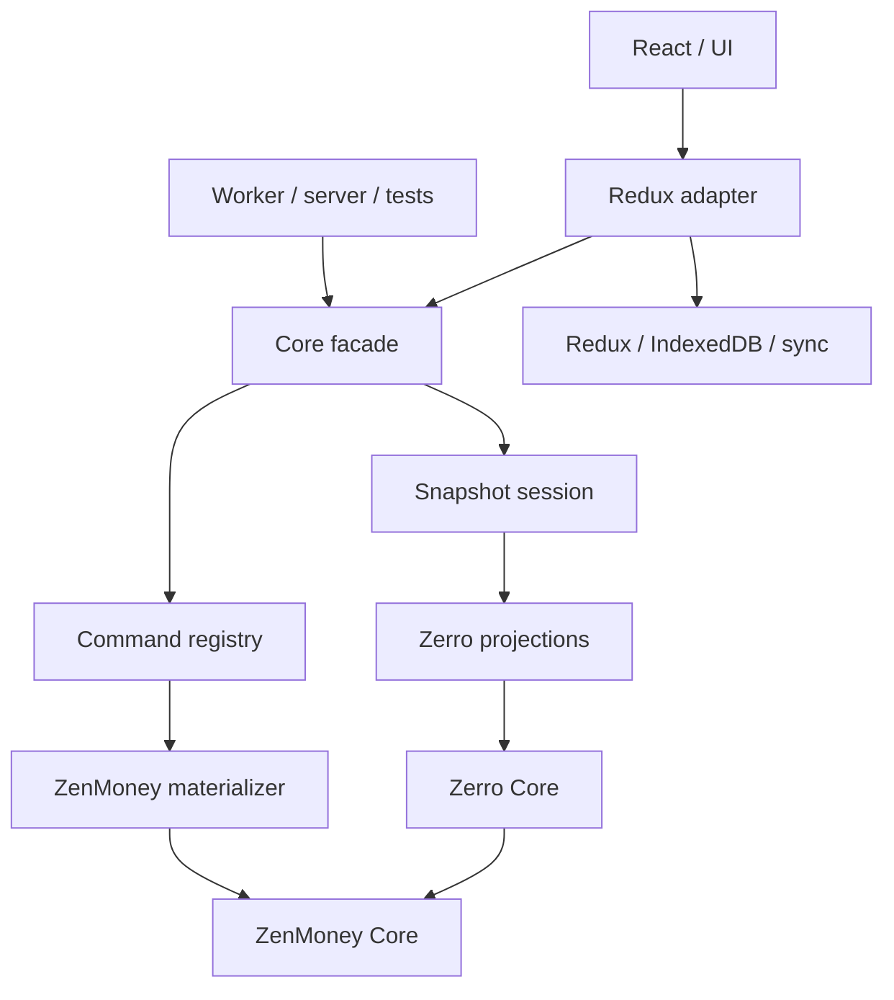

# Core Next architecture

- Status: accepted target architecture for an incremental migration
- Updated: 2026-07-10

## Purpose

Core Next extracts Zerro and normalized ZenMoney behavior into a module that
can run in the current React/Redux app, a worker, a local server, tests, or a
future local-only runtime.

The module is not a storage layer and does not own UI reactivity. It provides
pure domain operations plus facades that runtimes can adapt.

## Goals

1. Keep domain behavior independent of Redux, React, IndexedDB, localization,
   and the ZenMoney HTTP client.
2. Preserve Zerro hidden-data compatibility with ZenMoney entities.
3. Offer one ergonomic semantic facade for app and headless consumers.
4. Keep expensive projection dependencies visible and independently cached.
5. Support deterministic local commands, materialized effects, replay, and
   undo/redo without inverse patches.
6. Allow incremental migration with focused parity tests.

Near-term non-goals:

- solving memory pressure for the largest accounts;
- implementing rich field-level remote conflict previews;
- replacing Redux with a second reactive Core store;
- publishing a standalone package before its API stabilizes.

## Boundaries



Dependency direction is one-way:

```txt
shared primitives
  -> normalized ZenMoney entities and operations
  -> Zerro hidden data and domain behavior
  -> projections and materializer
  -> facade
  -> runtime adapters
```

Core must not import back from adapters or app layers.

## Change pipeline

Core distinguishes requested changes from their complete local effects:

```txt
state + command       -> intentPatch
state + intentPatch   -> appliedPatch
state + appliedPatch  -> nextState
base + appliedPatches -> current
state                 -> derived views
```

### Commands

Commands describe user intent and remain serializable:

```ts
type Command =
  | {
      type: 'zerro.envelope.patch'
      payload: EnvelopePatchInput
    }
  | {
      type: 'zerro.budget.set'
      payload: BudgetUpdate[]
    }
```

Internal compilers may keep the `compile*` prefix. The public facade should use
short domain verbs:

```ts
session.envelopes.patch({ id, changes })
engine.envelopes.rename(id, title)
engine.budgets.set(update)
```

Command inputs must describe writable intent, not reuse a full entity or
projection as `Partial<T>`. Prefer one-object arguments. Add explicit bulk APIs
only when their atomicity and error semantics are known; do not accept
`T | T[]` by default.

If compilation generates caller-only metadata, it returns:

```ts
type TCompiled<TReceipt> = {
  patch: TNormalizedPatch
  receipt: TReceipt
}
```

The receipt is not replay state.

### Materialization

Local writes pass through one ZenMoney-compatible materializer:

```txt
command
  -> intentPatch
  -> materializePatch(current, intentPatch)
  -> appliedPatch
  -> applyPatch(current, appliedPatch)
```

The current materializer is intentionally identity-only. It creates the
boundary without changing legacy behavior. Future rules belong here rather
than in every command compiler:

- changing transaction amounts updates affected account balances;
- deleting an account permanently deletes its non-transfer transactions;
- transfers involving a deleted account become income or outcome on the
  surviving account;
- a transaction already marked `deleted` ignores subsequent patches.

Materialization is pure and receives the current normalized snapshot. It must
return a complete deterministic `appliedPatch` and a rule-set version.

### Dumb patch application

`applyPatch` performs only the changes explicitly present in an applied patch.
It must not discover cascades, call external services, or interpret commands.

Canonical server diffs bypass local materialization because ZenMoney may have
already expanded the same effects.

## Public facade

The root entrypoint is the package-facing semantic surface:

```ts
import { createZerroSession } from 'core-next'
```

It must not re-export Redux adapters or whole implementation trees. The
reference engine and its outbox primitives are internal and are not root
exports; the Redux slice imports them through `core-next/engine/*`. During the
migration, app shims and tests may use explicit deep imports, but those paths
are not stable APIs.

### Snapshot session

`createZerroSession` represents one immutable snapshot. Its internal reads are
lazy and each node is evaluated at most once for the session lifetime. No
cross-snapshot invalidation is needed.

The intended semantic API groups reads by domain and uses `get*` names:

```ts
const session = createZerroSession(snapshot, { now, uuid })

session.envelopes.getAll()
session.envelopes.getStructure()
session.budgets.getAll()
session.months.getTotals()
```

The namespaced facade is implemented additively. Flat `session.read.*` remains
a deprecated migration surface for existing parity and private-fixture tests.

Session context contains only nondeterministic dependencies such as `now()` and
`uuid()`. Root user and currency are derived from normalized data.

### Runtime engine

The eventual engine facade should expose the same domain vocabulary as the
session, but execute commands and own undo/redo:

```ts
engine.envelopes.rename(id, title)
engine.budgets.set(update)
engine.undo()
engine.redo()
```

The current in-memory `createZerroEngine` is a pure reference primitive, not a
production state owner. In the React app, Redux must own replica state; a
Redux-backed facade dispatches commands without creating another store.

Internal pure outbox operations define head clamping, applied-prefix reads,
redo-tail truncation on append, and replay from stored applied patches. The
reference engine uses these operations; Redux can reuse them incrementally
without exposing them as root package API or introducing a second store.

Semantic commands append complete runtime outbox entries. Redux performs
authoritative `current` replay for append, undo, and redo. The sync adapter
derives its request-local transport diff directly from the same applied outbox
prefix; Redux no longer stores a parallel `data.diff` projection. There is still
only one reactive store.

Synchronization follows a deliberate clean/dirty session policy. While the
applied outbox prefix is empty, periodic sync may apply canonical server diffs
directly to `base`; `current` then equals `base`. Once a local command is
applied, periodic sync pauses until the user explicitly synchronizes.

Manual sync is a commit boundary. It discards the redo tail, records the exact
applied entry ids being sent, and sends their combined transport diff against
the current base server timestamp. A successful ZenMoney response is canonical:
it includes the accepted local changes, remote changes, and a new server
timestamp. The response updates `base`, all sent entries are removed, and only
commands created while the request was in flight are replayed over the new
base. A failed request leaves the applied outbox intact for retry.

Redux may temporarily stage a response between reducer actions, but that is an
implementation detail, not a product inbox. The first product version neither
polls nor stores remote changes while local changes are pending, and it keeps no
incoming-change history.

Replica persistence is a separate versioned IndexedDB record. It stores only
the replay inputs (base server timestamp, outbox, and head); `current`, pending
transport, and sync status are derived or ephemeral. Reload accepts a snapshot only when
its base timestamp matches the loaded server base, so legacy storage and stale
metadata do not replay against the wrong snapshot.

## Read model and memoization

Pure projectors own calculations. Runtimes own memoization.

```txt
Core projectors
  what to calculate and which inputs are required

Snapshot session
  lazy one-time memoization for one immutable snapshot

Redux adapter
  memoization across changing Redux snapshots
```

Do not create one selector from the entire `current` store. It would invalidate
transaction-heavy calculations after unrelated writes.

The important graph currently includes:

```txt
transactions -> debtors ----------------------> envelopes
tags + accounts + envelopeMeta ---------------> envelopes
transactions + accounts + debtors ------------> rawActivity
rawActivity + keepingEnvelopeIds --------------> activity
rawActivity + keepingEnvelopeIds + FX ---------> sortedActivity
transactions + budgets + currentMonth --------> monthList
monthList + envelopes + activity + budgets + FX
                                               -> envMetrics
monthList + currentFunds + activity + envMetrics + FX
                                               -> monthTotals
rawGoals + monthList + envMetrics + sortedActivity + FX
                                               -> goals
```

The important edges are recorded in `facade/readGraph.ts`. The map is
descriptive, not a runtime dependency framework; session and Redux wiring stay
explicit. Introduce more machinery only if manual wiring continues to create
real invalidation defects.

This duplication is intentional. `readGraph.ts` is the human-readable
specification of calculation dependencies, while the session/future engine and
Redux adapter wire those dependencies explicitly for different memoization and
reactivity models. Nothing is generated from the map today. Agents should not
treat agreement between the specification and those implementations as a DRY
violation or replace it with a graph runtime without a demonstrated defect.

Adapter-level projectors such as `buildRawActivity` and `buildEnvMetrics` may be
available to runtime adapters without appearing on the root semantic facade.
Private calculation helpers remain private.

Carry-forward projections such as `envMetrics` may need the full month range up
to the requested month. The optimization target is stable upstream caching,
not independent calculation of every month.

## Domain and presentation

Domain envelopes contain semantic state only: identity, normalized and source
titles, hierarchy, stable group id, configured tag color, visibility, currency,
and budgeting behavior.

Presentation envelopes may add:

- localized labels and group names;
- emoji and SVG resolution;
- generated and display colors;
- future bank logos for account envelopes.

Reusable appearance policy and catalogs should live in an optional
presentation package or package subpath. That package may accept localization
and asset resolvers, but domain Core must not import bundler-specific SVG URLs,
i18n, React, or Redux.

Write commands must resolve against domain envelopes, never localized or
presentation-decorated views. This boundary is implemented: the session builds
tag envelopes from Core tag structure, while the Redux adapter applies
`TPresentedEnvelope` fields and localized groups afterward. Before compiling an
app draft, the adapter maps known localized default-group labels back to stable
domain group ids.

## Internal responsibilities

### ZenMoney Core

Works only with normalized data and owns:

- normalized entities, ids, dates, and timestamps;
- root user and entity facts;
- patch application and replay;
- entity commands and factories;
- ZenMoney-derived debtors and balance history;
- materialized server-like rules when implemented.

Raw HTTP/wire conversion belongs to a sync adapter.

### Zerro Core

Depends on ZenMoney Core and owns:

- hidden-data formats and future migrations;
- the `🤖 [Zerro Data]` service-account convention;
- user settings, envelope metadata, envelope ids, budgets, goals, and FX data;
- high-level Zerro command compilation.

### Runtime adapters

Adapters own:

- Redux subscriptions and selector memoization;
- IndexedDB or other persistence;
- ZenMoney HTTP synchronization;
- React hooks and event tracking;
- localization and concrete assets.

## Replica model

The logical persisted replica consists of:

```ts
type ReplicaState = {
  base: TDataStore
  outbox: OutboxEntry[]
  outboxHead: number
}
```

`base.serverTimestamp` identifies the accepted server snapshot. Physical
storage may keep normalized base domains and outbox metadata in separate
records, but together they must describe one coherent logical replica.

`base` is the last accepted snapshot. `current` is derived by replaying the
applied outbox prefix:

```ts
current = replay(
  base,
  outbox.slice(0, outboxHead).map(entry => entry.appliedPatch)
)
```

An outbox entry stores both intent and deterministic replay data:

```ts
type OutboxEntry = {
  id: string
  command: Command
  intentPatch: TNormalizedPatch
  appliedPatch: TNormalizedPatch
  materializerVersion: number
  createdAt: number
}
```

Replay never recompiles commands or rematerializes historical intent.

Undo and redo move only `outboxHead`. A new command after undo drops the redo
tail. Starting manual sync also drops the redo tail because synchronization
commits the currently applied history branch. No inverse patches are stored.

Only `base`, `outbox`, and `outboxHead` are durable inputs. `current` and the
request-local transport diff are derived; sync progress and errors are ephemeral.
There is no durable inbox or incoming-change history.

The next replica implementation must share pure outbox operations with the
reference engine or fold the reference engine into Redux. Two implementations
of append, replay-prefix, clamp, and redo-tail rules are not acceptable.

## Sync and conflicts

Successful ZenMoney responses are canonical normalized diffs. They contain the
accepted local changes as well as remote changes and the new server timestamp:

```txt
sent applied outbox prefix + base timestamp -> ZenMoney
successful canonical diff                 -> applyPatch(base, diff)
                                          -> remove sent entries
                                          -> replay later local entries
```

The first implementation treats any successful response as acceptance of the
whole sent batch; it does not require per-command acknowledgement. If the
request fails, neither base nor the applied outbox changes.

Periodic sync uses the same canonical response boundary but runs only when the
applied outbox prefix is empty. This intentionally trades remote freshness
during a dirty editing session for a simple user model without background
rebases or a product inbox.

Before the materializer becomes non-identity, sync must decide whether to send
minimal intent, expanded applied patches, or choose through a transport encoder.
That decision remains in [design-ledger.md](./design-ledger.md).

First-stage conflict resolution is entity-level last write wins. Replaying a
local full-entity patch over a remote entity update replaces the remote entity.
Hidden-data blobs inherit the same limitation.

Revisit this only when multi-device editing or remote previews justify semantic
rebase. Stored high-level commands leave room for revalidation or recompilation,
but normal replay stays patch-based and deterministic.

## Migrations and compatibility

Hidden-data migrations belong to Zerro Core because the hidden format is a
domain contract. Core should read old formats and compile a write-back patch
when an upgrade is needed.

Temporary app bridges and exit criteria are tracked in
[design-ledger.md](./design-ledger.md). Do not preserve a bridge merely because
it appears in legacy code; preserve it until its listed replacement is ready.

## Architectural invariants

1. Production Core imports no Redux, React, storage, i18n, ZenMoney HTTP, or
   runtime values from `6-shared`.
2. Root `core-next` stays facade-only; adapter subpaths are explicit.
3. Root user and user currency are derived from data.
4. Nondeterminism enters through explicit context.
5. Projectors expose explicit dependencies; expensive nodes do not depend on
   the whole store.
6. Session memoization is snapshot-local; Redux owns cross-snapshot
   memoization.
7. Commands use narrow semantic inputs and do not import Redux selectors.
8. Local intent passes through the materializer; canonical server diffs do not.
9. `applyPatch` remains dumb and deterministic.
10. Replay uses stored `appliedPatch`, never recompilation.
11. Redux remains the sole replica owner in the React app.
12. Presentation decoration is not domain state.
13. Private fixture comparisons use hashes or safe summaries.
14. Every migration slice is small, independently testable, and documented
    when it changes a boundary or next step.
