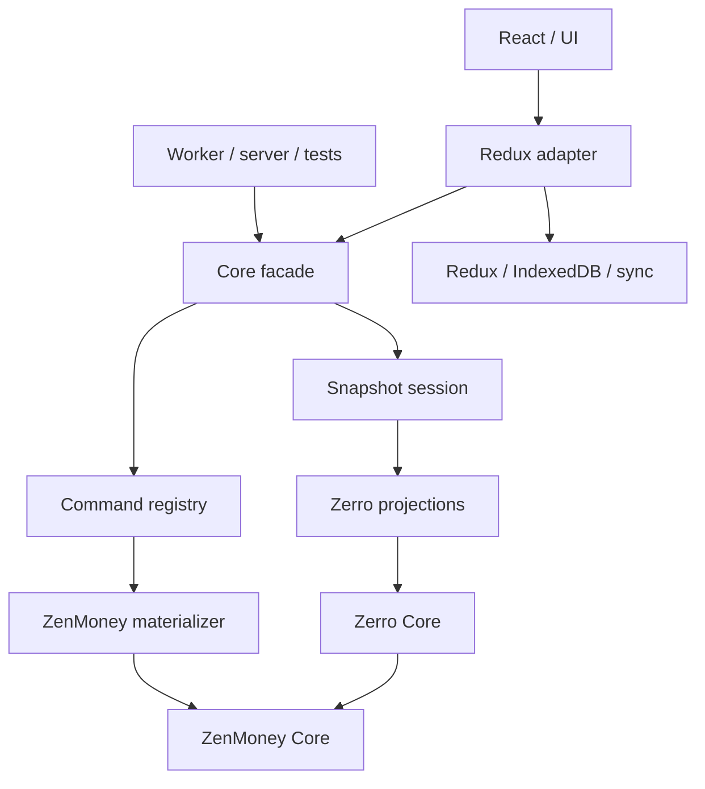
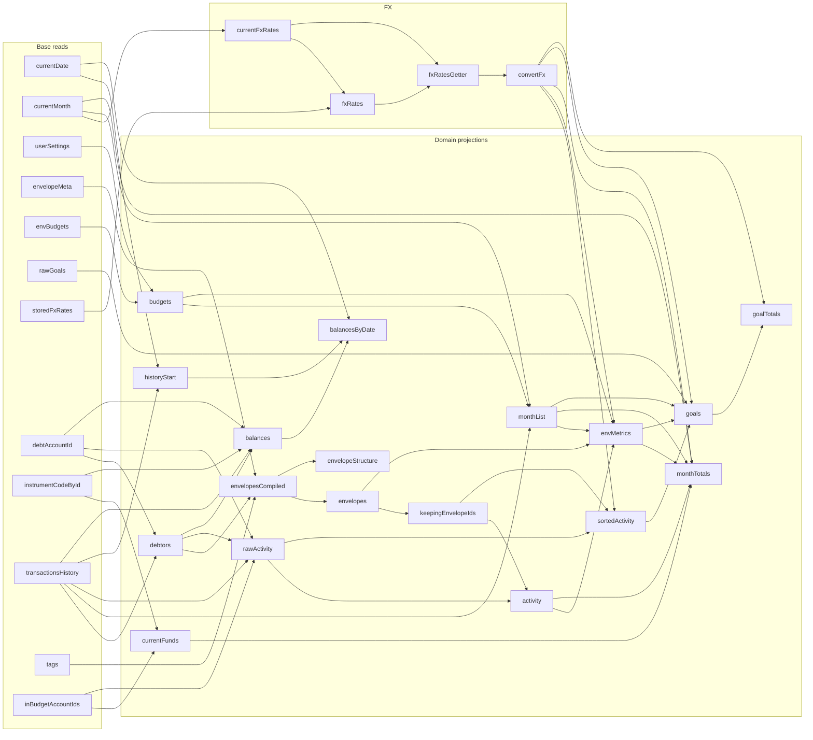

# Zerro Core architecture

- Status: accepted target architecture for an incremental migration
- Updated: 2026-07-19

## Purpose

Zerro Core extracts Zerro and normalized ZenMoney behavior into a module that
can run in the current React/Redux app, a worker, a local server, tests, or a
future local-only runtime.

The module is not a storage layer and does not own UI reactivity. It provides
pure domain operations plus facades that runtimes can adapt.

## Goals

1. Keep domain behavior independent of Redux, React, IndexedDB, localization,
   and the ZenMoney HTTP client.
2. Preserve Zerro hidden-data compatibility with ZenMoney entities.
3. Offer one ergonomic semantic facade for app and headless consumers.
4. Keep expensive projection dependencies visible and independently cached.
5. Support deterministic local commands, materialized effects, replay, and
   undo/redo without inverse patches.
6. Allow incremental migration with focused parity tests.

Near-term non-goals:

- solving memory pressure for the largest accounts;
- implementing rich field-level remote conflict previews;
- replacing Redux with a second reactive Core store;
- publishing a standalone package before its API stabilizes.

## Boundaries



Dependency direction is one-way:

```txt
shared primitives
  -> normalized ZenMoney entities and operations
  -> Zerro hidden data and domain behavior
  -> projections and materializer
  -> facade
  -> runtime adapters
```

Core must not import back from adapters or app layers.

## Change pipeline

Core persists requested changes and derives their complete local effects:

```txt
base + command prefix -> materialized patches -> current
base + command prefix -> fresh transport patch
current               -> derived views
```

### Commands

Durable commands describe sparse user intent and remain serializable. The
outbox stores one command shape directly:

```ts
type Command = {
  type: 'patch'
  issuedAt: TMsTime
  patch: IntentPatch
}

type IntentPatch = {
  account?: AccountPatch[]
  merchant?: MerchantPatch[]
  tag?: TagPatch[]
  budget?: BudgetPatch[]
  reminder?: ReminderPatch[]
  transaction?: TransactionPatch[]
  deletion?: DeleteIntent[]
}
```

This list is closed. Reference and server-owned families such as instruments,
countries, companies, users, and reminder markers are not command intent. The
issue and persistence boundaries reject them instead of implicitly inheriting
every `TDiff` member.

Entity patch types live beside their entity types and document locally writable
fields through `EntityPatch<TEntity, TWritableFields>`. The helper makes `id`
required and only the explicitly listed writable fields optional. A present id
is patched and a missing id is created. This upsert rule deliberately favors one
simple command shape over separate create/update operations.

Command issue captures generated ids, `issuedAt`, and every other
nondeterministic input. Replay must not call ambient time or generate a new id.
Deletion intent stores entity identity; materialization adds protocol metadata.

Internal compilers may keep the `compile*` prefix. The public facade should use
short domain verbs:

```ts
engine.envelopes.rename({ id, name })
engine.budgets.set(update)
```

Commands set absolute values and must be idempotent under rebase. Semantic Redux
verbs may use different compilers, but they all issue this persisted patch
shape. Relative requests such as toggle or increment are resolved to absolute
values before issue.

If compilation generates caller-only metadata, it returns:

```ts
type TCompiled<TReceipt> = {
  patch: TIntentPatch
  receipt: TReceipt
}
```

The receipt is not replay state.

### Materialization

Local writes pass through one deterministic pipeline:

```txt
base
  -> expand sparse primary intent
  -> derive predicted server effects
  -> applyPatch(primary + effects)
  -> repeat for the next command
  -> current
```

Sparse patches read the latest entity and overlay only present fields. A missing
id invokes the entity factory and creates a complete entity; an incomplete
creation intent fails before it can be persisted. Patching an entity that
disappeared remotely therefore recreates it after rebase. Command order resolves
delete-then-patch and repeated field writes.

Future predicted server rules belong here rather than in command compilers:

- changing transaction amounts updates affected account balances;
- deleting an account permanently deletes its non-transfer transactions;
- transfers involving a deleted account become income or outcome on the
  surviving account;
- a transaction already marked `deleted` ignores subsequent patches.

Ownership is split by behavior rather than by pipeline stage. Each entity
domain owns its writable patch contract, its sparse-to-full primary expansion,
and effects triggered by changing that entity. The application materializer
keeps the command loop: it invokes those rules against the latest snapshot,
orders primary changes and effects, and combines changes across entity maps.
Thus a transaction balance rule belongs near transactions, while the generic
materializer does not move wholesale into domain.

Materialization is pure and receives the current normalized snapshot, command,
and explicit version time. Local replay uses `issuedAt`; request transport uses
a fresh `sentAt`. Local `current` contains primary changes plus predicted
effects. Transport is built from a separate primary-only replay so predicted
server effects are never sent as client intent.

### Dumb patch application

`applyPatch` performs only the changes explicitly present in an applied patch.
It must not discover cascades, call external services, or interpret commands.

Canonical server diffs bypass local materialization because ZenMoney may have
already expanded the same effects.

## Public facade

The root entrypoint is the package-facing semantic surface:

```ts
import { createZerroSession } from 'zerro-core'
```

It must not re-export Redux adapters or whole implementation trees. The
reference engine and its outbox primitives are internal and are not root
exports; the Redux slice imports them through `zerro-core/infrastructure/replica/*`. During the
migration, app shims and tests may use explicit deep imports, but those paths
are not stable APIs.

The React app uses one explicit Redux adapter entrypoint grouped by domain:

```ts
import {
  envelopes as coreEnvelopes,
  transactions as coreTransactions,
} from 'zerro-core/redux'

const envelopes = useAppSelector(coreEnvelopes.selectAll)
dispatch(coreEnvelopes.rename(id, name))
dispatch(coreTransactions.remove(ids))
```

The namespaces contain granular selectors, hooks, semantic command creators,
and their domain types. They do not own state or read the Redux store
imperatively. Flat adapter exports are intentionally unsupported.

Each Redux domain module owns its selector implementations and hook wrappers;
there is no shared selector or hook barrel. `redux/state.ts` contains only raw
slice/time inputs. Command-time derived reads use `commandRead.ts`, which builds
an immutable snapshot on demand and deliberately does not participate in the
memoized selector graph.

### Snapshot session

`createZerroSession` represents one immutable snapshot. Its internal reads are
lazy and each node is evaluated at most once for the session lifetime. No
cross-snapshot invalidation is needed.

The intended semantic API groups reads by domain and uses `get*` names:

```ts
const session = createZerroSession(snapshot, { now, uuid })

session.envelopes.getAll()
session.envelopes.getStructure()
session.budgets.getAll()
session.months.getTotals()
```

The snapshot session exposes only namespaced reads; new reads belong on the
matching domain namespace.

Session context contains only nondeterministic dependencies such as `now()` and
`uuid()`. Root user and currency are derived from normalized data.

### Runtime engine

The eventual engine facade should expose the same domain vocabulary as the
session, but execute commands and own undo/redo:

```ts
engine.envelopes.rename({ id, name })
engine.budgets.set(update)
engine.undo()
engine.redo()
```

The current in-memory `createZerroEngine` is a pure reference primitive, not a
production state owner. In the React app, Redux must own replica state; a
Redux-backed facade dispatches commands without creating another store.

Internal pure outbox operations define head clamping, command-prefix reads,
redo-tail truncation on append, and command rematerialization. The
reference engine uses these operations; Redux can reuse them incrementally
without exposing them as root package API or introducing a second store.

Issued commands append directly to the outbox. Redux performs
authoritative `current` rematerialization for append, undo, redo, and base
changes. The sync adapter derives request transport from the same command
prefix; Redux stores no parallel `data.diff` projection.

Periodic and manual sync use the same primary-only transport path. Whether a
dirty session syncs automatically remains an adapter policy, not a capability
classification between persisted command kinds.

Manual sync is a commit boundary. It discards the redo tail, records the sent
prefix length, and rematerializes its transport against the current base with
fresh entity versions. Undo/redo is disabled while the request is active, so
new commands can only append after that stable prefix. A successful ZenMoney
response updates `base` and acknowledges the whole sent prefix. Core removes
exactly the captured command count without comparing final field values. This
matters when several commands changed the same field: the last value wins, while
every sent command remains part of the accepted batch. Commands created while
the request was in flight are preserved and replayed over the new base.

Redux may temporarily stage a response between reducer actions, but that is an
implementation detail, not a product inbox. Rebase-safe commands may accept
background canonical changes, but Core keeps no incoming-change history.

Replica persistence is a separate versioned IndexedDB record. It stores only
the replay inputs (base server timestamp, outbox, and head); `current`, pending
transport, and sync status are derived or ephemeral. Reload accepts a snapshot only when
its base timestamp matches the loaded server base, so legacy storage and stale
metadata do not replay against the wrong snapshot.

## Read model and memoization

Pure projectors own calculations. Runtimes own memoization.

```txt
Core projectors
  what to calculate and which inputs are required

Snapshot session
  lazy one-time memoization for one immutable snapshot

Redux adapter
  memoization across changing Redux snapshots
```

Do not create one selector from the entire `current` store. It would invalidate
transaction-heavy calculations after unrelated writes.

The important session read dependencies are documented here rather than as
executable graph metadata. Snapshot-session and Redux wiring remain explicit in
their owning modules; raw snapshot fields and context inputs are omitted.



Keep this diagram aligned with meaningful projection changes during normal
review. Do not turn it into a graph runtime unless explicit wiring causes
repeated, demonstrated defects.

Adapter-level projectors such as `buildRawActivity` and `buildEnvMetrics` may be
available to runtime adapters without appearing on the root semantic facade.
Private calculation helpers remain private.

Carry-forward projections such as `envMetrics` may need the full month range up
to the requested month. The optimization target is stable upstream caching,
not independent calculation of every month.

## Domain and presentation

Domain envelopes contain semantic state only: identity, normalized and source
titles, hierarchy, stable group id, configured tag color, visibility, currency,
and budgeting behavior.

Presentation envelopes may add:

- localized labels and group names;
- emoji and SVG resolution;
- generated and display colors;
- future bank logos for account envelopes.

Reusable appearance policy and catalogs should live in an optional
presentation package or package subpath. That package may accept localization
and asset resolvers, but domain Core must not import bundler-specific SVG URLs,
i18n, React, or Redux.

Write commands must resolve against domain envelopes, never localized or
presentation-decorated views. This boundary is implemented: the session builds
tag envelopes from Core tag structure, while the Redux adapter applies
`TPresentedEnvelope` fields and localized groups afterward. Before compiling an
app draft, the adapter maps known localized default-group labels back to stable
domain group ids.

## Internal responsibilities

### ZenMoney Core

Works only with normalized data and owns:

- normalized entities, ids, dates, and timestamps;
- root user and entity facts;
- patch application and replay;
- entity commands and factories;
- ZenMoney-derived debtors and balance history;
- materialized server-like rules when implemented.

Raw HTTP/wire conversion belongs to a sync adapter.

### Zerro Core

Depends on ZenMoney Core and owns:

- hidden-data formats and future migrations;
- the `🤖 [Zerro Data]` service-account convention;
- user settings, envelope metadata, envelope ids, budgets, goals, and FX data;
- high-level Zerro command compilation.

### Runtime adapters

Adapters own:

- Redux subscriptions and selector memoization;
- IndexedDB or other persistence;
- ZenMoney HTTP synchronization;
- React hooks and event tracking;
- localization and concrete assets.

## Replica model

The logical persisted replica consists of:

```ts
type ReplicaState = {
  base: TDataStore
  outbox: Command[]
  outboxHead: number
}
```

`base.serverTimestamp` identifies the accepted server snapshot. Physical
storage may keep normalized base domains and outbox metadata in separate
records, but together they must describe one coherent logical replica.

`base` is the last accepted snapshot. `current` is derived by rematerializing
the command prefix:

```ts
current = materializeCommands(base, outbox.slice(0, outboxHead))
```

The outbox stores commands directly:

```ts
type Command = {
  type: 'patch'
  issuedAt: TMsTime
  patch: IntentPatch
}
```

Replica persistence stores the current command-only schema. There are no
compatibility or migration requirements for an older command format.
Malformed replay metadata is discarded rather than blocking canonical local
data from loading.

Undo and redo move only `outboxHead`. A new command after undo drops the redo
tail. Starting manual sync also drops the redo tail because synchronization
commits the currently applied history branch. No inverse patches are stored.

Only `base`, `outbox`, and `outboxHead` are durable inputs. `current` and the
request-local transport diff are derived; sync progress and errors are ephemeral.
There is no durable inbox or incoming-change history.

The next replica implementation must share pure outbox operations with the
reference engine or fold the reference engine into Redux. Two implementations
of append, replay-prefix, clamp, and redo-tail rules are not acceptable.

## Sync and conflicts

Successful ZenMoney responses are canonical normalized diffs. They contain the
accepted local changes as well as remote changes and the new server timestamp:

```txt
fresh transport from command prefix + cursor -> ZenMoney
canonical diff                               -> applyPatch(base, diff)
                                             -> drop sent command count
                                             -> rematerialize pending commands
```

Transport replay starts from `base`, applies only primary command patches to a
working snapshot, and records touched ids and deletions. The final full entities
come from that primary-only snapshot, never from UI `current` with predicted
effects. A successful response acknowledges and removes exactly the captured
sent prefix. If the request fails, neither base nor the command outbox changes.

Periodic sync uses the same canonical response and whole-prefix acknowledgement
boundary.

First-stage conflict resolution is field-level last write wins in command
order. Upsert intentionally recreates a missing entity. Revisit this only with
evidence that remote deletion or silent partial rejection needs a different
product policy or multi-device editing justifies a richer conflict model.

## Migrations and compatibility

Hidden-data migrations belong to Zerro Core because the hidden format is a
domain contract. Core should read old formats and compile a write-back patch
when an upgrade is needed.

Temporary app bridges and exit criteria are tracked in
[design-ledger.md](./design-ledger.md). Do not preserve a bridge merely because
it appears in legacy code; preserve it until its listed replacement is ready.

## Architectural invariants

1. Production Core imports no Redux, React, storage, i18n, ZenMoney HTTP, or
   runtime values from `6-shared`.
2. Root `zerro-core` stays facade-only; adapter subpaths are explicit.
3. Root user and user currency are derived from data.
4. Nondeterminism enters through explicit context.
5. Projectors expose explicit dependencies; expensive nodes do not depend on
   the whole store.
6. Session memoization is snapshot-local; Redux owns cross-snapshot
   memoization.
7. Commands use narrow semantic inputs and do not import Redux selectors.
8. Local intent passes through the materializer; canonical server diffs do not.
9. `applyPatch` remains dumb and deterministic.
10. Replay rematerializes issued patch commands in prefix order.
11. Redux remains the sole replica owner in the React app.
12. Presentation decoration is not domain state.
13. Real-account fixtures require a concrete regression case and must never
    print or commit private contents.
14. Every migration slice is small, independently testable, and documented
    when it changes a boundary or next step.
